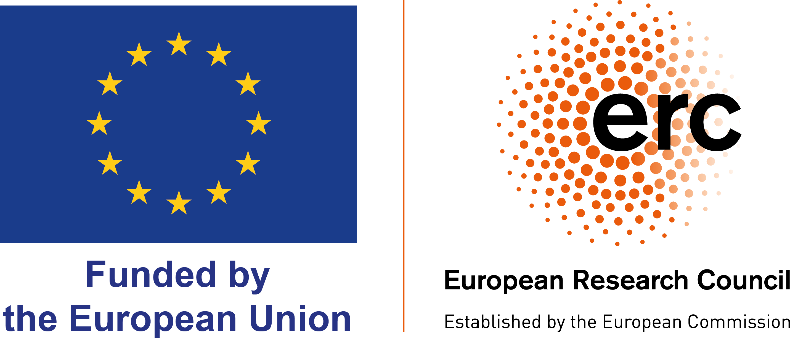

## Overview

CONTRUST investigates one of the most repeated but least settled claims in democratic politics: that political trust helps governments address difficult policy problems. Political leaders, public bodies, and researchers often assume that trust matters for policy support, but the theoretical and empirical basis for that claim remains uneven.

The project develops a systematic account of when trust matters, who or what is being trusted, and which policy tasks make trust consequential. It focuses on three major governance challenges: climate and the environment, redistribution and inequality, and crime prevention.

Over 5 years, the project will provide new panel data, experiments, merging of existing panel data, and a multi-team meta study. It also aims to build reusable data resources and collaborative research designs that help the wider field test the consequences of political trust more transparently.

## Research Questions

The project will answer a range of questions.

- How, when, and why does political trust shape public support for major policy action?
- When does trust matter more: when policies involve uncertainty, sacrifice, risk, or particular political actors and institutions?
- Do existing survey measures of political trust capture the policy-specific judgements citizens actually make?
- How stable are trust attitudes over time, and how do changes in trust relate to changes in policy support?
- How much do research design choices affect findings about the consequences of political trust?

<!-- ## Work Packages -->

<!-- ::: {.timeline} -->
<!-- ::: {.timeline-item} -->
<!-- ### WP1: Theory Development -->

<!-- Develops the project's conceptual framework. CONTRUST builds from the idea that trust involves a relationship: a citizen trusts an actor or institution to do something. This helps specify who is trusted, what policy task is at stake, and why uncertainty matters. -->
<!-- ::: -->

<!-- ::: {.timeline-item} -->
<!-- ### WP2: Qualitative Validation -->

<!-- Uses focus groups in the United Kingdom, Netherlands, and Portugal to understand how citizens interpret trust questions and whether they connect trust to attitudes in the project's three policy domains. -->
<!-- ::: -->

<!-- ::: {.timeline-item} -->
<!-- ### WP3: Harmonising Trust Over Time -->

<!-- Scopes, merges, and documents existing longitudinal panel datasets with repeated political trust measures. The aim is to create reusable resources for studying how trust changes and what those changes predict. -->
<!-- ::: -->

<!-- ::: {.timeline-item} -->
<!-- ### WP4: Trust Across Time And Space -->

<!-- Fields original three-wave panel surveys with embedded experiments in six European countries: Croatia, Denmark, Germany, Netherlands, Portugal, and the United Kingdom. -->
<!-- ::: -->

<!-- ::: {.timeline-item} -->
<!-- ### WP5: Collaborative Meta-Studies -->

<!-- Invites independent research teams to analyse selected experimental data. CONTRUST will then compare and synthesise those analyses to assess the robustness of conclusions about trust and policy support. -->
<!-- ::: -->
<!-- ::: -->

<!-- ## Methods -->

<!-- CONTRUST uses a sequential mixed-methods design. Qualitative work helps clarify concepts and measurement; harmonised longitudinal data places existing evidence in comparative perspective; original panel and experimental surveys test mechanisms across countries and policy domains; collaborative meta-studies assess how robust findings are across research teams. -->

<!-- The six-country design captures variation in levels and trends of political trust across Europe. Quantitative fieldwork covers Croatia, Denmark, Germany, Netherlands, Portugal, and the United Kingdom. Qualitative fieldwork is planned for the United Kingdom, Netherlands, and Portugal. -->

<!-- All data collection will follow relevant ethical review, data protection, and GDPR procedures. Where possible, code, documentation, and data resources will be made available for wider research use. -->

## Funding

CONTRUST is funded by the European Research Council and hosted at the University of Southampton. 

::: {.project-logo-panel}
::: {.partner-logo-box}

:::

::: {.partner-logo-box}

:::
:::
